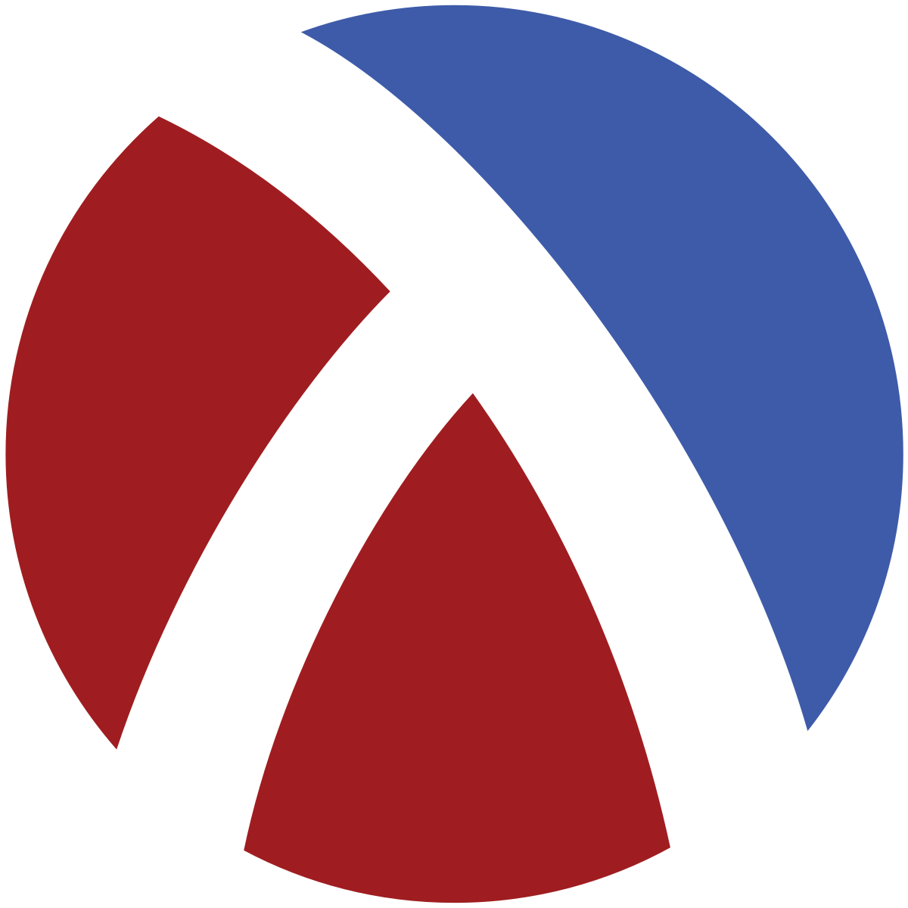

# TC2037-act3.4

    

    Resaltador de Sintaxis utilizando el lenguaje de programación Racket

# Equipo

Equipo:
- Gamaliel Marines Olvera A01708746
- Rodrigo Terán Hernández A01704108
- Diego Perdomo Salcedo A01709150

 

## Proyecto

1. Para este actividad, emplearemos el lenguaje de programación C#. Determina las categorías léxicas del mismo (por ejemplo, palabras reservadas, operadores, literales, comentarios, etc.)
2. Define las expresiones regulares que emplearías para reconocer cada una de las categorías léxicas que detectaste. 
3. Coloca tus representaciones en un archivo de texto con una estructura y organización que resulte conveniente para los siguientes pasos.
4. Usando Racket, implementa un motor de expresiones regulares que tome las expresiones regulares del punto 2 y con ello esté en condiciones de escanear los elementos léxicos de cualquier archivo fuente de C# provisto.
5. El programa debe convertir su entrada en documentos de HTML+CSS que resalten su léxico.
6. Utiliza las convenciones de codificación de Racket.
7. Reflexiona sobre la solución planteada, los algoritmos implementados y sobre el tiempo de ejecución de estos.
8. Calcula la complejidad de tu algoritmo basada en el número de iteraciones y contrástala con el tiempo obtenido en el punto 7.
9. Plasma en un breve reporte de una página las conclusiones de tu reflexión en los puntos 7 y 8. Agrega además una breve reflexión sobre las implicaciones éticas que el tipo de tecnología que desarrollaste pudiera tener en la sociedad.

Para esta actividad se sugiere utilizar la técnica didáctica POL (Aprendizaje Basado en Proyectos, por sus siglas en inglés).
